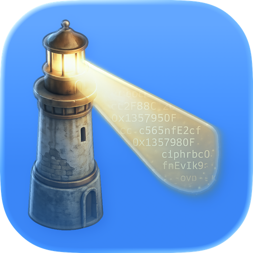

<p align="center">
  
</p>

<h1 align="center">Pharos</h1>

<p align="center">A native macOS PostgreSQL client built with Swift and Rust.</p>

---

## Install

Download a `.dmg` from [Releases](https://github.com/NeodymiumPhish/Pharos/releases/latest). The app is unsigned -- after extracting, run:

```
xattr -c Pharos.app
```

Requires macOS 14.0 (Sonoma) or later. Supports PostgreSQL 10+ servers.

## Features

- **Schema browser** -- Tree view with tables, views, foreign tables, functions, indexes, and constraints. Search bar, row count estimates, table sizes, and context menus (view rows, clone, import, export, copy DDL).
- **SQL editor** -- Syntax highlighting, schema-aware autocomplete, bracket matching, and multi-tab support.
- **Query execution** -- Run and cancel queries with paginated results.
- **Results grid** -- Native table with click-to-sort columns, find-in-results, and display options for grid lines, row numbers, zebra striping, and NULL format.
- **Inspector** -- Single-row detail view and multi-row aggregation with type-aware statistics.
- **Column filters** -- Per-column filter popovers with type-specific operators (text, numeric, boolean, null).
- **Data export** -- Export results or full tables to CSV, TSV, JSON, JSON Lines, SQL INSERT, Markdown, or XLSX.
- **Data import** -- Import CSV files with automatic type inference.
- **Saved queries** -- Organize queries into folders with drag-and-drop.
- **Query history** -- Search and browse past queries with date grouping.
- **Connections** -- SSL support (disable/prefer/require), color-coded server icons, and Keychain password storage.
- **Settings** -- Theme, font, tab size, word wrap, and row limit configuration.

## Build from Source

Requires macOS 14.0+, Xcode 16+, and a [Rust toolchain](https://rustup.rs).

```
git clone https://github.com/NeodymiumPhish/Pharos.git
cd Pharos
cd pharos-core && cargo build --release && cd ..
open Pharos.xcodeproj
```

Build and run with **Cmd+R** in Xcode.

## Stack

AppKit / Swift / Rust / sqlx / cbindgen / SQLite

## Docs

Full documentation at **[neodymiumphish.github.io/Pharos](https://neodymiumphish.github.io/Pharos/)**.

## License

[MIT with Non-Commercial Clause](LICENSE) -- free to use, modify, and distribute, but the software and derivatives may not be sold or commercially monetized without permission.
